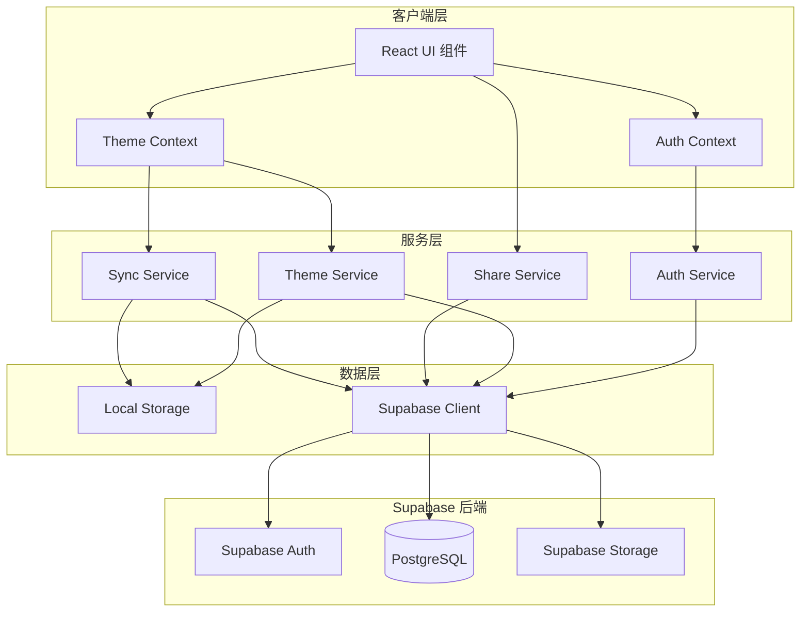
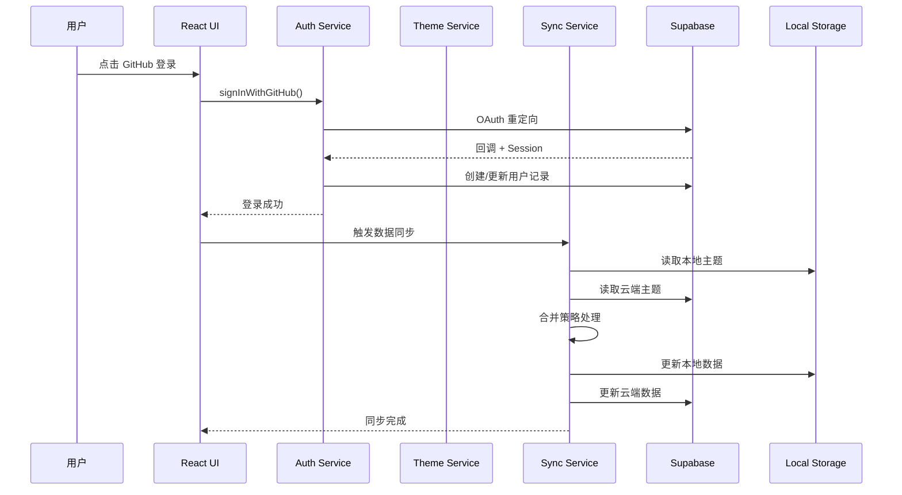

# 设计文档

## 概述

本设计文档描述了 Markdown 编辑器应用的 GitHub 登录认证和用户数据存储功能的技术实现方案。系统基于 Supabase Auth 实现 GitHub OAuth 登录，使用 Supabase Database 存储用户信息、主题配置和分享内容。

### 核心设计目标

1. **无缝集成**：与现有主题系统无缝集成，最小化对现有代码的改动
2. **离线优先**：未登录用户仍可使用本地存储功能
3. **数据一致性**：合理处理本地与云端数据的同步冲突
4. **安全性**：使用 Supabase RLS（行级安全）保护用户数据

## 架构



### 数据流



## 组件和接口

### 1. Auth Service (`lib/supabase/auth.ts`)

负责处理 GitHub OAuth 认证流程。

```typescript
interface AuthService {
  // 使用 GitHub 登录
  signInWithGitHub(): Promise<void>;
  
  // 登出
  signOut(): Promise<void>;
  
  // 获取当前用户
  getCurrentUser(): Promise<User | null>;
  
  // 监听认证状态变化
  onAuthStateChange(callback: (user: User | null) => void): () => void;
  
  // 获取会话信息
  getSession(): Promise<Session | null>;
}
```

### 2. Auth Context (`lib/supabase/auth-context.tsx`)

提供认证状态的 React Context。

```typescript
interface AuthContextValue {
  // 当前用户
  user: User | null;
  
  // 用户资料
  profile: UserProfile | null;
  
  // 加载状态
  loading: boolean;
  
  // 登录方法
  signIn: () => Promise<void>;
  
  // 登出方法
  signOut: () => Promise<void>;
  
  // 是否已登录
  isAuthenticated: boolean;
}
```

### 3. Theme Service (`lib/supabase/theme-service.ts`)

负责主题数据的云端存储和同步。

```typescript
interface ThemeService {
  // 保存自定义主题到云端
  saveTheme(userId: string, theme: Theme): Promise<void>;
  
  // 获取用户的所有自定义主题
  getThemes(userId: string): Promise<Theme[]>;
  
  // 删除自定义主题
  deleteTheme(userId: string, themeId: string): Promise<void>;
  
  // 保存默认主题设置
  saveDefaultTheme(userId: string, themeId: string): Promise<void>;
  
  // 获取默认主题设置
  getDefaultTheme(userId: string): Promise<string | null>;
}
```

### 4. Sync Service (`lib/supabase/sync-service.ts`)

负责本地和云端数据的同步策略。

```typescript
interface SyncService {
  // 执行完整同步
  syncThemes(userId: string): Promise<SyncResult>;
  
  // 获取同步状态
  getSyncStatus(): SyncStatus;
}

interface SyncResult {
  uploaded: string[];   // 上传到云端的主题 ID
  downloaded: string[]; // 从云端下载的主题 ID
  conflicts: string[];  // 冲突解决的主题 ID
}

type SyncStatus = 'idle' | 'syncing' | 'error';
```

### 5. Share Service (`lib/supabase/share-service.ts`)

负责文章分享功能。

```typescript
interface ShareService {
  // 创建分享
  createShare(content: ShareContent): Promise<string>;
  
  // 获取分享内容
  getShare(shareId: string): Promise<ShareContent | null>;
  
  // 删除分享
  deleteShare(shareId: string): Promise<void>;
}

interface ShareContent {
  id?: string;
  markdown: string;
  themeId: string;
  themeStyles: ThemeStyles;
  createdAt?: string;
  expiresAt?: string | null;
}
```

### 6. UI 组件

#### LoginButton (`app/_components/auth/LoginButton.tsx`)

```typescript
interface LoginButtonProps {
  className?: string;
}
```

#### UserMenu (`app/_components/auth/UserMenu.tsx`)

```typescript
interface UserMenuProps {
  user: User;
  profile: UserProfile;
  onSignOut: () => void;
}
```

#### ShareDialog (`app/_components/share/ShareDialog.tsx`)

```typescript
interface ShareDialogProps {
  markdown: string;
  themeId: string;
  open: boolean;
  onOpenChange: (open: boolean) => void;
}
```

## 数据模型

### 数据库表结构

#### 1. user_profiles 表

存储用户基本信息。

```sql
CREATE TABLE user_profiles (
  id UUID PRIMARY KEY REFERENCES auth.users(id) ON DELETE CASCADE,
  github_id TEXT UNIQUE NOT NULL,
  username TEXT NOT NULL,
  avatar_url TEXT,
  email TEXT,
  created_at TIMESTAMPTZ DEFAULT NOW(),
  updated_at TIMESTAMPTZ DEFAULT NOW()
);

-- 启用 RLS
ALTER TABLE user_profiles ENABLE ROW LEVEL SECURITY;

-- 用户只能读写自己的数据
CREATE POLICY "Users can view own profile" ON user_profiles
  FOR SELECT USING (auth.uid() = id);

CREATE POLICY "Users can update own profile" ON user_profiles
  FOR UPDATE USING (auth.uid() = id);
```

#### 2. user_themes 表

存储用户自定义主题。

```sql
CREATE TABLE user_themes (
  id UUID PRIMARY KEY DEFAULT gen_random_uuid(),
  user_id UUID REFERENCES user_profiles(id) ON DELETE CASCADE,
  theme_id TEXT NOT NULL,
  name TEXT NOT NULL,
  description TEXT,
  styles JSONB NOT NULL,
  custom_css TEXT,
  created_at TIMESTAMPTZ DEFAULT NOW(),
  updated_at TIMESTAMPTZ DEFAULT NOW(),
  UNIQUE(user_id, theme_id)
);

-- 启用 RLS
ALTER TABLE user_themes ENABLE ROW LEVEL SECURITY;

-- 用户只能读写自己的主题
CREATE POLICY "Users can manage own themes" ON user_themes
  FOR ALL USING (auth.uid() = user_id);
```

#### 3. user_settings 表

存储用户设置（包括默认主题）。

```sql
CREATE TABLE user_settings (
  id UUID PRIMARY KEY DEFAULT gen_random_uuid(),
  user_id UUID UNIQUE REFERENCES user_profiles(id) ON DELETE CASCADE,
  default_theme_id TEXT,
  settings JSONB DEFAULT '{}',
  created_at TIMESTAMPTZ DEFAULT NOW(),
  updated_at TIMESTAMPTZ DEFAULT NOW()
);

-- 启用 RLS
ALTER TABLE user_settings ENABLE ROW LEVEL SECURITY;

-- 用户只能读写自己的设置
CREATE POLICY "Users can manage own settings" ON user_settings
  FOR ALL USING (auth.uid() = user_id);
```

#### 4. shared_articles 表

存储分享的文章。

```sql
CREATE TABLE shared_articles (
  id UUID PRIMARY KEY DEFAULT gen_random_uuid(),
  user_id UUID REFERENCES user_profiles(id) ON DELETE SET NULL,
  markdown TEXT NOT NULL,
  theme_id TEXT NOT NULL,
  theme_styles JSONB NOT NULL,
  created_at TIMESTAMPTZ DEFAULT NOW(),
  expires_at TIMESTAMPTZ
);

-- 启用 RLS
ALTER TABLE shared_articles ENABLE ROW LEVEL SECURITY;

-- 任何人都可以读取分享的文章
CREATE POLICY "Anyone can view shared articles" ON shared_articles
  FOR SELECT USING (true);

-- 只有创建者可以删除
CREATE POLICY "Users can delete own shares" ON shared_articles
  FOR DELETE USING (auth.uid() = user_id);

-- 登录用户可以创建分享
CREATE POLICY "Authenticated users can create shares" ON shared_articles
  FOR INSERT WITH CHECK (auth.uid() = user_id);
```

### TypeScript 类型定义

```typescript
// lib/supabase/types.ts

export interface UserProfile {
  id: string;
  github_id: string;
  username: string;
  avatar_url: string | null;
  email: string | null;
  created_at: string;
  updated_at: string;
}

export interface UserTheme {
  id: string;
  user_id: string;
  theme_id: string;
  name: string;
  description: string | null;
  styles: ThemeStyles;
  custom_css: string | null;
  created_at: string;
  updated_at: string;
}

export interface UserSettings {
  id: string;
  user_id: string;
  default_theme_id: string | null;
  settings: Record<string, unknown>;
  created_at: string;
  updated_at: string;
}

export interface SharedArticle {
  id: string;
  user_id: string | null;
  markdown: string;
  theme_id: string;
  theme_styles: ThemeStyles;
  created_at: string;
  expires_at: string | null;
}
```


## 正确性属性

*正确性属性是一种应该在系统所有有效执行中保持为真的特征或行为——本质上是关于系统应该做什么的形式化陈述。属性作为人类可读规范和机器可验证正确性保证之间的桥梁。*

### 属性 1: 用户信息持久化往返

*对于任意* 有效的 GitHub 用户信息，创建用户记录后查询该用户，应返回包含相同 GitHub ID、用户名、头像 URL 和邮箱的完整用户数据对象。

**验证: 需求 2.1, 2.2, 2.3, 2.4**

### 属性 2: 主题数据往返一致性

*对于任意* 有效的主题配置对象，保存到数据库后再读取，应返回与原始主题配置完全等价的对象（包括所有 CSS 属性）。

**验证: 需求 3.5**

### 属性 3: 主题 CRUD 操作正确性

*对于任意* 用户和任意主题操作序列（创建、读取、更新、删除），执行操作后查询主题列表，应反映所有操作的累积效果：
- 创建后主题应存在于列表中
- 更新后主题应包含新的数据
- 删除后主题应不存在于列表中

**验证: 需求 3.1, 3.2, 3.3, 3.4, 4.1**

### 属性 4: 分享内容往返一致性

*对于任意* 有效的 Markdown 内容和主题配置，创建分享后通过分享 ID 访问，应返回包含相同 Markdown 内容和主题样式的分享对象，且无需认证即可访问。

**验证: 需求 6.1, 6.2, 6.3, 6.6**

### 属性 5: 同步合并策略正确性

*对于任意* 本地主题集合和云端主题集合，执行同步后：
- 仅存在于本地的主题应上传到云端
- 仅存在于云端的主题应下载到本地
- 同时存在但内容不同的主题应使用更新时间较新的版本
- 同步后本地和云端的主题集合应一致

**验证: 需求 7.1, 7.2, 7.3, 7.4**

### 属性 6: 会话有效性验证

*对于任意* 用户会话，检查会话有效性时应正确判断会话是否在有效期内（7天），过期会话应返回无效状态。

**验证: 需求 5.2**

## 错误处理

### 认证错误

| 错误场景 | 处理方式 |
|---------|---------|
| GitHub OAuth 授权被拒绝 | 显示友好提示，保持未登录状态 |
| OAuth 回调参数无效 | 记录错误日志，重定向到首页 |
| 会话过期 | 自动登出，提示用户重新登录 |
| 网络错误导致认证失败 | 显示重试按钮，允许用户重试 |

### 数据同步错误

| 错误场景 | 处理方式 |
|---------|---------|
| 云端数据读取失败 | 使用本地缓存，后台重试 |
| 云端数据写入失败 | 保存到本地队列，下次同步时重试 |
| 数据格式不兼容 | 记录错误，跳过该条数据 |
| 并发冲突 | 使用乐观锁，提示用户刷新 |

### 分享功能错误

| 错误场景 | 处理方式 |
|---------|---------|
| 分享创建失败 | 显示错误提示，允许重试 |
| 分享链接无效 | 显示 404 页面 |
| 分享内容已过期 | 显示过期提示页面 |
| 分享内容过大 | 提示用户缩减内容 |

## 测试策略

### 单元测试

单元测试用于验证具体示例和边界情况：

1. **Auth Service 测试**
   - 测试 `signInWithGitHub` 调用正确的 Supabase 方法
   - 测试 `signOut` 清除会话
   - 测试 OAuth 回调处理

2. **Theme Service 测试**
   - 测试主题 CRUD 操作
   - 测试数据格式转换
   - 测试错误处理

3. **Sync Service 测试**
   - 测试合并策略的边界情况
   - 测试冲突解决逻辑
   - 测试网络错误处理

4. **Share Service 测试**
   - 测试分享创建和读取
   - 测试过期时间处理
   - 测试无效链接处理

### 属性测试

属性测试用于验证跨所有输入的通用属性。使用 `fast-check` 库进行属性测试。

每个属性测试必须：
- 运行至少 100 次迭代
- 使用注释标记对应的设计属性
- 格式: **Feature: github-auth-storage, Property {number}: {property_text}**

#### 属性测试配置

```typescript
import fc from 'fast-check';

// 用户信息生成器
const userProfileArbitrary = fc.record({
  github_id: fc.string({ minLength: 1, maxLength: 20 }),
  username: fc.string({ minLength: 1, maxLength: 39 }),
  avatar_url: fc.option(fc.webUrl()),
  email: fc.option(fc.emailAddress()),
});

// 主题配置生成器
const themeArbitrary = fc.record({
  id: fc.uuid(),
  name: fc.string({ minLength: 1, maxLength: 50 }),
  description: fc.string({ maxLength: 200 }),
  styles: themeStylesArbitrary,
});

// 分享内容生成器
const shareContentArbitrary = fc.record({
  markdown: fc.string({ minLength: 1, maxLength: 10000 }),
  themeId: fc.string({ minLength: 1 }),
  themeStyles: themeStylesArbitrary,
});
```

### 集成测试

集成测试验证组件之间的交互：

1. **认证流程集成测试**
   - 完整的登录-登出流程
   - 会话刷新流程

2. **数据同步集成测试**
   - 登录后的数据同步流程
   - 离线-在线切换场景

3. **分享功能集成测试**
   - 创建分享-访问分享流程
   - 分享过期处理

### 测试环境

- 使用 Vitest 作为测试框架
- 使用 fast-check 进行属性测试
- 使用 Supabase 本地开发环境进行集成测试
- 使用 Mock Service Worker (MSW) 模拟网络请求
