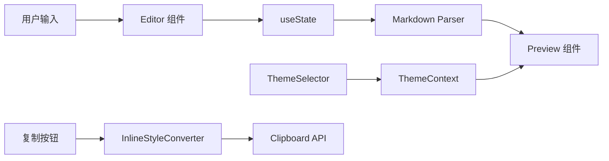

# 设计文档：Markdown 编辑器

## 概述

本文档描述了一个 Markdown 编辑器 Web 应用的技术设计，包含双栏布局、实时预览、可定制主题系统和微信公众号复制功能。应用使用 Next.js 14 (App Router) + shadcn/ui + Tailwind CSS 构建，提供现代化的开发体验和优秀的用户界面。

## 技术栈

- **框架**: Next.js 14 (App Router)
- **UI 组件库**: shadcn/ui
- **样式**: Tailwind CSS
- **表单验证**: react-hook-form + Zod
- **Markdown 解析**: marked.js
- **状态管理**: React useState/useContext
- **测试**: Vitest + fast-check (属性测试)

## 架构

应用采用 Next.js App Router 的模块化架构：

```
app/
├── layout.tsx              # 根布局，包含 ThemeProvider 和 Toaster
├── page.tsx                # 主页面（编辑器）
├── globals.css             # 全局样式
└── _components/            # 页面组件
    ├── editor/
    │   ├── Editor.tsx      # 编辑器组件
    │   ├── Toolbar.tsx     # 工具栏组件
    │   └── hooks.ts        # 编辑器相关 hooks
    ├── preview/
    │   ├── Preview.tsx     # 预览组件
    │   └── themes/         # 主题样式定义
    └── theme-selector/
        └── ThemeSelector.tsx

components/ui/              # shadcn/ui 组件
├── button.tsx
├── textarea.tsx
├── select.tsx
├── tabs.tsx
├── dialog.tsx
└── ...

lib/
├── themes/                 # 主题系统
│   ├── types.ts           # 主题类型定义
│   ├── built-in.ts        # 内置主题
│   └── theme-context.tsx  # 主题 Context
├── markdown/              # Markdown 处理
│   └── parser.ts          # 解析器封装
├── clipboard/             # 剪贴板功能
│   ├── inline-converter.ts # 行内样式转换
│   └── copy.ts            # 复制功能
└── storage.ts             # localStorage 封装
```

### 数据流



## 组件和接口

### 1. Editor 组件

处理 Markdown 文本输入和编辑操作。

```typescript
// app/_components/editor/Editor.tsx
interface EditorProps {
  value: string;
  onChange: (value: string) => void;
  className?: string;
}

// 编辑器 hooks
interface UseEditorReturn {
  // 在光标位置插入文本
  insertAtCursor: (text: string) => void;
  
  // 用前缀和后缀包裹选中文本
  wrapSelection: (prefix: string, suffix: string) => void;
  
  // 获取 textarea ref
  textareaRef: React.RefObject<HTMLTextAreaElement>;
}
```

### 2. Preview 组件

渲染解析后的 Markdown 为带样式的 HTML。

```typescript
// app/_components/preview/Preview.tsx
interface PreviewProps {
  html: string;
  className?: string;
}

// 获取当前渲染的 HTML（用于复制）
function getPreviewHTML(): string;
```

### 3. 主题系统

使用 React Context 管理主题注册、选择和持久化。

```typescript
// lib/themes/theme-context.tsx
interface ThemeContextValue {
  // 当前激活的主题
  activeTheme: Theme;
  
  // 所有可用主题
  themes: Theme[];
  
  // 设置激活主题
  setActiveTheme: (id: string) => void;
  
  // 保存自定义主题
  saveCustomTheme: (theme: Theme) => void;
  
  // 删除自定义主题
  deleteCustomTheme: (id: string) => void;
  
  // 导出主题为 JSON
  exportTheme: (id: string) => string;
  
  // 从 JSON 导入主题
  importTheme: (json: string) => Theme;
}

// 使用主题的 hook
function useTheme(): ThemeContextValue;
```

### 4. 行内样式转换器

将 CSS 类转换为行内样式，用于剪贴板导出。

```typescript
// lib/clipboard/inline-converter.ts
interface InlineStyleConverter {
  // 将带类名的 HTML 转换为带行内样式的 HTML
  convert: (html: string, theme: Theme) => string;
}
```

### 5. 剪贴板管理

处理带格式 HTML 的复制操作。

```typescript
// lib/clipboard/copy.ts
// 复制 HTML 内容到剪贴板
async function copyHTML(html: string): Promise<boolean>;

// 复制纯文本到剪贴板
async function copyText(text: string): Promise<boolean>;
```

## 数据模型

### 主题 Schema

```typescript
// lib/themes/types.ts
interface Theme {
  id: string;                    // 唯一标识符 (kebab-case)
  name: string;                  // 显示名称
  description: string;           // 主题描述
  isBuiltIn: boolean;           // 是否为内置主题
  styles: ThemeStyles;          // 样式定义
}

interface ThemeStyles {
  // 基础样式
  background: string;           // 背景色
  text: string;                 // 主要文字颜色
  textSecondary: string;        // 次要文字颜色
  
  // 标题样式
  h1: HeadingStyle;
  h2: HeadingStyle;
  h3: HeadingStyle;
  h4: HeadingStyle;
  h5: HeadingStyle;
  h6: HeadingStyle;
  
  // 内容样式
  paragraph: ParagraphStyle;
  link: LinkStyle;
  blockquote: BlockquoteStyle;
  code: CodeStyle;
  codeBlock: CodeBlockStyle;
  list: ListStyle;
  table: TableStyle;
  image: ImageStyle;
  hr: HrStyle;
}

interface HeadingStyle {
  color: string;
  fontSize: string;
  fontWeight: string;
  lineHeight: string;
  marginTop: string;
  marginBottom: string;
  borderBottom?: string;
  paddingBottom?: string;
}

interface ParagraphStyle {
  color: string;
  fontSize: string;
  lineHeight: string;
  marginBottom: string;
}

interface LinkStyle {
  color: string;
  textDecoration: string;
  hoverColor?: string;
}

interface BlockquoteStyle {
  background: string;
  borderLeft: string;
  color: string;
  padding: string;
  margin: string;
  fontStyle: string;
}

interface CodeStyle {
  background: string;
  color: string;
  padding: string;
  borderRadius: string;
  fontFamily: string;
  fontSize: string;
}

interface CodeBlockStyle {
  background: string;
  color: string;
  padding: string;
  borderRadius: string;
  fontFamily: string;
  fontSize: string;
  lineHeight: string;
  overflow: string;
}

interface ListStyle {
  color: string;
  marginLeft: string;
  marginBottom: string;
  lineHeight: string;
  listStyleType?: string;
}

interface TableStyle {
  borderColor: string;
  headerBackground: string;
  headerColor: string;
  cellPadding: string;
  evenRowBackground?: string;
}

interface ImageStyle {
  maxWidth: string;
  borderRadius: string;
  margin: string;
}

interface HrStyle {
  border: string;
  margin: string;
}
```

### 内置主题定义

```typescript
// lib/themes/built-in.ts
const BUILT_IN_THEMES: Theme[] = [
  {
    id: 'default-white',
    name: '默认白色',
    description: '简洁清爽的白色主题',
    isBuiltIn: true,
    styles: {
      background: '#ffffff',
      text: '#1a1a1a',
      textSecondary: '#666666',
      // ... 详细样式
    }
  },
  {
    id: 'oled-dark',
    name: '暗黑主题',
    description: 'OLED 深黑护眼主题',
    isBuiltIn: true,
    styles: {
      background: '#000000',
      text: '#e0e0e0',
      textSecondary: '#a0a0a0',
      // ... 详细样式
    }
  },
  {
    id: 'ink-green',
    name: '墨绿主题',
    description: '类似墨滴风格的墨绿主题',
    isBuiltIn: true,
    styles: {
      background: '#f5f5f5',
      text: '#2d3436',
      textSecondary: '#636e72',
      // ... 绿色强调色
    }
  },
  {
    id: 'orange-warm',
    name: '橙色暖色',
    description: '温暖舒适的橙色主题',
    isBuiltIn: true,
    styles: {
      background: '#fffaf5',
      text: '#3d3d3d',
      textSecondary: '#666666',
      // ... 橙色强调色
    }
  },
  {
    id: 'purple-elegant',
    name: '紫色优雅',
    description: '优雅现代的紫色主题',
    isBuiltIn: true,
    styles: {
      background: '#faf8ff',
      text: '#2d2d2d',
      textSecondary: '#666666',
      // ... 紫色强调色
    }
  },
  {
    id: 'blue-tech',
    name: '蓝色科技',
    description: '专业技术感的蓝色主题',
    isBuiltIn: true,
    styles: {
      background: '#f8fafc',
      text: '#1e293b',
      textSecondary: '#64748b',
      // ... 蓝色强调色
    }
  }
];
```

### 存储 Schema

```typescript
// lib/storage.ts
interface StorageSchema {
  // 激活的主题 ID
  activeThemeId: string;
  
  // 自定义主题数组
  customThemes: Theme[];
  
  // 编辑器偏好设置
  editorPreferences: {
    showLineNumbers: boolean;
    syncScroll: boolean;
    fontSize: number;
  };
  
  // 最后编辑的内容（自动保存）
  lastContent: string;
}
```


## 正确性属性

*属性是指在系统所有有效执行中都应保持为真的特征或行为——本质上是关于系统应该做什么的形式化陈述。属性是人类可读规范和机器可验证正确性保证之间的桥梁。*

基于前期分析，已识别出以下正确性属性：

### 属性 1: Markdown 解析产生有效的 HTML 结构

*对于任何*包含标题、粗体、斜体、链接、图片、代码块、列表、引用或表格的有效 Markdown 输入，解析后应产生包含相应语义元素（h1-h6、strong、em、a、img、pre/code、ul/ol/li、blockquote、table）的 HTML。

**验证: 需求 2.2, 2.3**

### 属性 2: 主题持久化往返

*对于任何*被设置为激活的主题 ID，保存到 localStorage 后在应用重启时加载，应恢复相同的激活主题 ID。

**验证: 需求 3.3, 3.4**

### 属性 3: 自定义主题存储往返

*对于任何*有效的自定义主题对象，保存到主题系统后通过 ID 检索，应返回一个所有属性都保持不变的等效主题对象。

**验证: 需求 3.5, 5.4**

### 属性 4: 主题导出/导入往返

*对于任何*主题（内置或自定义），导出为 JSON 后再从该 JSON 导入，应产生与原始主题等效的主题对象。

**验证: 需求 5.5, 5.6**

### 属性 5: 行内样式转换完整性

*对于任何*使用主题渲染的 HTML 内容，转换为行内样式后，每个带样式的元素都应将其所有视觉属性（颜色、背景、字体、内边距、外边距、边框）作为行内 style 属性，不依赖任何 CSS 类。

**验证: 需求 6.1, 6.4**

### 属性 6: 主题注册和检索

*对于任何*在主题系统中注册的有效主题对象，使用该主题的 ID 调用 getTheme 应返回相同的主题对象。

**验证: 需求 3.1**

### 属性 7: 主题应用反映样式

*对于任何*在主题系统中选择的主题，预览面板的计算样式（背景色、文字颜色）应与主题定义的样式值匹配。

**验证: 需求 3.2**

### 属性 8: 文本格式化正确包裹选中内容

*对于任何*编辑器中的文本选择和任何格式化操作（粗体、斜体、链接、代码），应用格式应使用正确的 Markdown 语法包裹选中文本，同时保留原始文本内容。

**验证: 需求 7.2**

### 属性 9: 滚动位置保持

*对于任何*编辑器中的滚动位置，在不改变滚动区域的内容更新后，滚动位置应保持在原始位置的小容差范围内（±5px）。

**验证: 需求 2.4**

### 属性 10: 主题验证接受有效配置并拒绝无效配置

*对于任何*主题配置对象，验证函数应当且仅当所有必需字段（id、name、带必需属性的 styles）都存在且值有效时返回 true。

**验证: 需求 5.2**

## 错误处理

### Markdown 解析错误

- **无效 Markdown**: 解析器应优雅地处理格式错误的 Markdown，将其渲染为纯文本
- **空内容**: 空输入应渲染为空预览，不产生错误
- **大内容**: 超过合理限制（>1MB）的内容应显示警告

### 主题系统错误

- **缺失主题**: 如果存储的主题 ID 不存在，回退到默认主题
- **存储损坏**: 如果 localStorage 数据损坏，重置为默认值并通知用户
- **无效主题导入**: 导入无效 JSON 时显示验证错误

### 剪贴板错误

- **权限拒绝**: 如果剪贴板访问被拒绝，显示用户友好的消息
- **复制失败**: 提供手动复制说明作为后备方案
- **空内容**: 如果预览为空，阻止复制操作

### 存储错误

- **存储已满**: 当 localStorage 接近容量时警告用户
- **存储不可用**: 回退到仅会话模式并显示警告

## 测试策略

### 单元测试

单元测试关注特定示例、边界情况和错误条件：

- **Markdown 解析器**: 单独测试每种 Markdown 元素类型
- **主题系统**: 测试主题 CRUD 操作
- **行内样式转换器**: 测试每种元素类型的样式转换
- **剪贴板管理**: 使用模拟的剪贴板 API 测试复制操作

### 属性测试

属性测试验证跨多个生成输入的通用属性。我们将使用 **fast-check** 库进行 JavaScript 属性测试。

**配置**:
- 每个属性测试最少 100 次迭代
- 每个测试标记为: **Feature: markdown-editor, Property {number}: {property_text}**

**属性测试实现**:

1. **Markdown 解析** (属性 1): 生成随机有效 Markdown 字符串，验证 HTML 输出包含预期元素
2. **主题持久化** (属性 2): 生成随机主题 ID，验证通过 localStorage 的往返
3. **自定义主题存储** (属性 3): 生成随机有效主题对象，验证存储往返
4. **主题导出/导入** (属性 4): 生成主题，验证 JSON 往返
5. **行内样式转换** (属性 5): 生成带主题的 HTML，验证所有样式都已内联
6. **主题注册** (属性 6): 生成主题，验证注册和检索
7. **主题应用** (属性 7): 生成主题，验证计算样式匹配
8. **文本格式化** (属性 8): 生成文本选择和格式类型，验证包裹
9. **滚动保持** (属性 9): 生成滚动位置和内容更新，验证保持
10. **主题验证** (属性 10): 生成有效和无效配置，验证验证结果

### 集成测试

- 测试 Editor → Parser → Preview 数据流
- 测试主题选择 → 样式应用 → 复制流程
- 测试断点处的响应式布局

### 手动测试

- 主题外观的视觉验证
- 微信公众号粘贴测试（无法自动化）
- 跨浏览器兼容性测试
