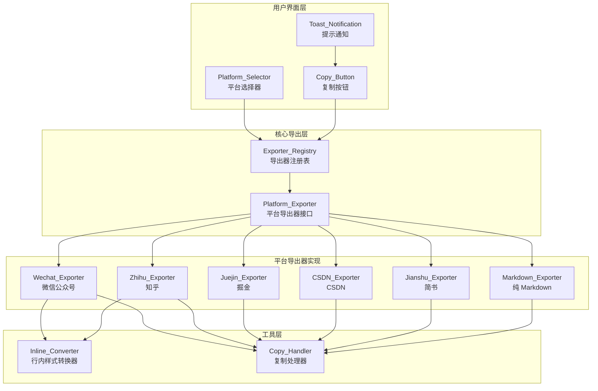
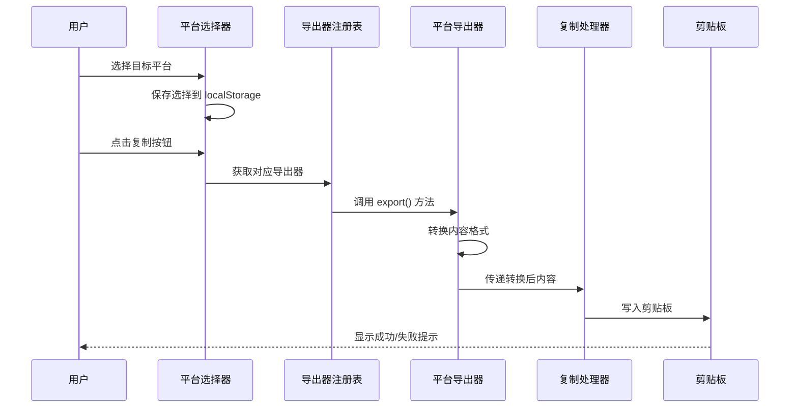

# 设计文档

## 概述

本设计文档描述多平台导出功能的技术实现方案。该功能基于现有的微信公众号复制功能进行扩展，采用策略模式设计可扩展的平台导出器架构，支持将 Markdown 内容导出为不同平台兼容的格式。

### 设计目标

1. **可扩展性**：采用策略模式，便于添加新平台支持
2. **向后兼容**：保持现有微信公众号功能不变
3. **用户体验**：提供直观的平台选择界面和即时反馈
4. **代码复用**：最大化复用现有的样式转换和复制功能

## 架构

### 整体架构图



### 数据流图



## 组件和接口

### 1. 平台导出器接口 (PlatformExporter)

```typescript
/**
 * 平台导出器接口
 * 所有平台导出器必须实现此接口
 */
interface PlatformExporter {
  /** 平台唯一标识 */
  id: string;
  
  /** 平台显示名称 */
  name: string;
  
  /** 平台图标（Lucide 图标名称或自定义 SVG） */
  icon: string;
  
  /** 导出格式类型 */
  formatType: 'html' | 'markdown' | 'text';
  
  /**
   * 导出内容
   * @param markdown - 原始 Markdown 文本
   * @param html - 渲染后的 HTML（带样式）
   * @param theme - 当前主题配置
   * @returns 转换后的内容
   */
  export(markdown: string, html: string, theme: Theme): ExportResult;
}

/**
 * 导出结果
 */
interface ExportResult {
  /** 导出的内容 */
  content: string;
  
  /** 内容类型（用于剪贴板） */
  mimeType: 'text/html' | 'text/plain';
  
  /** 纯文本备份（用于不支持 HTML 的场景） */
  plainText?: string;
}
```

### 2. 微信公众号复制（保持不变）

微信公众号复制使用现有的 ClipboardJS + `data-clipboard-target` 方案，直接复制预览区域的 DOM 内容：

```typescript
/**
 * 微信公众号复制 - 保持现有实现不变
 * 使用 ClipboardJS 的 data-clipboard-target 直接复制 DOM
 */
// 在 Toolbar.tsx 中的现有实现：
const clipboard = new ClipboardJS(copyButtonRef.current);
// 按钮上设置 data-clipboard-target={previewSelector}
```

这种方式能够完美保留所有行内样式，确保粘贴到微信公众号时格式正确。

### 3. 导出器注册表 (ExporterRegistry)

```typescript
/**
 * 导出器注册表
 * 管理所有平台导出器的注册和获取
 */
interface ExporterRegistry {
  /**
   * 注册导出器
   * @param exporter - 平台导出器实例
   */
  register(exporter: PlatformExporter): void;
  
  /**
   * 获取导出器
   * @param id - 平台标识
   * @returns 对应的导出器，不存在则返回 undefined
   */
  get(id: string): PlatformExporter | undefined;
  
  /**
   * 获取所有已注册的导出器
   * @returns 导出器列表
   */
  getAll(): PlatformExporter[];
}
```

### 3. 复制处理器 (CopyHandler)

```typescript
/**
 * 复制处理器
 * 负责将内容复制到剪贴板
 */
interface CopyHandler {
  /**
   * 复制 HTML 内容
   * @param html - HTML 内容
   * @param plainText - 纯文本备份
   * @returns 是否成功
   */
  copyHTML(html: string, plainText?: string): Promise<boolean>;
  
  /**
   * 复制纯文本
   * @param text - 文本内容
   * @returns 是否成功
   */
  copyText(text: string): Promise<boolean>;
}
```

### 4. 平台选择器组件 (PlatformSelector)

```typescript
/**
 * 平台选择器组件 Props
 */
interface PlatformSelectorProps {
  /** 当前选中的平台 ID */
  value: string;
  
  /** 平台变更回调 */
  onChange: (platformId: string) => void;
  
  /** 可用平台列表 */
  platforms: PlatformExporter[];
  
  /** 自定义类名 */
  className?: string;
}
```

## 数据模型

### 平台配置

```typescript
/**
 * 平台配置常量
 */
const PLATFORMS = {
  WECHAT: 'wechat',
  ZHIHU: 'zhihu',
  JUEJIN: 'juejin',
  CSDN: 'csdn',
  JIANSHU: 'jianshu',
  MARKDOWN: 'markdown',
} as const;

type PlatformId = typeof PLATFORMS[keyof typeof PLATFORMS];
```

### 平台元数据

```typescript
/**
 * 平台元数据
 */
interface PlatformMeta {
  id: PlatformId;
  name: string;
  icon: string;
  description: string;
  formatType: 'html' | 'markdown' | 'text';
  features: {
    supportsInlineStyles: boolean;
    supportsCodeHighlight: boolean;
    supportsImages: boolean;
    supportsTables: boolean;
    supportsLatex: boolean;
  };
}

/**
 * 预定义平台元数据
 */
const PLATFORM_META: Record<PlatformId, PlatformMeta> = {
  wechat: {
    id: 'wechat',
    name: '微信公众号',
    icon: 'MessageCircle',
    description: '带行内样式的 HTML，适合微信公众号编辑器',
    formatType: 'html',
    features: {
      supportsInlineStyles: true,
      supportsCodeHighlight: true,
      supportsImages: true,
      supportsTables: true,
      supportsLatex: false,
    },
  },
  zhihu: {
    id: 'zhihu',
    name: '知乎',
    icon: 'BookOpen',
    description: '知乎兼容的 HTML 格式',
    formatType: 'html',
    features: {
      supportsInlineStyles: false,
      supportsCodeHighlight: true,
      supportsImages: true,
      supportsTables: true,
      supportsLatex: true,
    },
  },
  juejin: {
    id: 'juejin',
    name: '掘金',
    icon: 'Code2',
    description: '标准 Markdown 格式',
    formatType: 'markdown',
    features: {
      supportsInlineStyles: false,
      supportsCodeHighlight: true,
      supportsImages: true,
      supportsTables: true,
      supportsLatex: true,
    },
  },
  csdn: {
    id: 'csdn',
    name: 'CSDN',
    icon: 'FileText',
    description: 'CSDN 兼容的 Markdown 格式',
    formatType: 'markdown',
    features: {
      supportsInlineStyles: false,
      supportsCodeHighlight: true,
      supportsImages: true,
      supportsTables: true,
      supportsLatex: true,
    },
  },
  jianshu: {
    id: 'jianshu',
    name: '简书',
    icon: 'Feather',
    description: '简化的 Markdown 格式',
    formatType: 'markdown',
    features: {
      supportsInlineStyles: false,
      supportsCodeHighlight: true,
      supportsImages: true,
      supportsTables: true,
      supportsLatex: false,
    },
  },
  markdown: {
    id: 'markdown',
    name: '纯 Markdown',
    icon: 'FileCode',
    description: '原始 Markdown 格式',
    formatType: 'text',
    features: {
      supportsInlineStyles: false,
      supportsCodeHighlight: true,
      supportsImages: true,
      supportsTables: true,
      supportsLatex: true,
    },
  },
};
```

### 用户偏好存储

```typescript
/**
 * 用户偏好存储键
 */
const STORAGE_KEY = 'qingyu-export-platform';

/**
 * 用户偏好
 */
interface UserPreference {
  /** 上次选择的平台 */
  lastPlatform: PlatformId;
}
```

## 文件结构

```
lib/
├── clipboard/
│   ├── copy.ts                    # 现有复制功能（保持不变）
│   ├── inline-converter.ts        # 现有行内样式转换器（保持不变）
│   └── index.ts                   # 导出入口
├── export/
│   ├── types.ts                   # 类型定义
│   ├── registry.ts                # 导出器注册表
│   ├── exporters/
│   │   ├── index.ts               # 导出器入口
│   │   ├── wechat.ts              # 微信公众号导出器
│   │   ├── zhihu.ts               # 知乎导出器
│   │   ├── juejin.ts              # 掘金导出器
│   │   ├── csdn.ts                # CSDN 导出器
│   │   ├── jianshu.ts             # 简书导出器
│   │   └── markdown.ts            # 纯 Markdown 导出器
│   └── index.ts                   # 模块入口
app/
├── _components/
│   └── editor/
│       ├── Toolbar.tsx            # 工具栏（修改）
│       └── PlatformSelector.tsx   # 平台选择器（新增）
```


## 正确性属性

*正确性属性是指在系统所有有效执行中都应保持为真的特征或行为——本质上是关于系统应该做什么的形式化陈述。属性作为人类可读规范和机器可验证正确性保证之间的桥梁。*

### Property 1: 导出器接口一致性

*对于任意* 已注册的平台导出器，该导出器必须包含 id（非空字符串）、name（非空字符串）、icon（非空字符串）、formatType（'html' | 'markdown' | 'text' 之一）和 export 方法（函数类型）。

**Validates: Requirements 1.1**

### Property 2: 注册表往返一致性

*对于任意* 平台导出器，将其注册到注册表后，使用相同的 id 获取导出器应返回完全相同的实例；且 getAll() 返回的列表应包含所有已注册的导出器。

**Validates: Requirements 1.3, 1.4**

### Property 3: 微信复制保持不变

微信公众号复制必须保持使用现有的 ClipboardJS + `data-clipboard-target` 方案，直接复制 DOM 内容，不做任何修改。

**Validates: Requirements 2.1**

### Property 4: 知乎格式转换

*对于任意* Markdown 内容，经过知乎导出器转换后：
- 代码块应使用 `<pre><code>` 标签结构
- 图片 URL 应与原始 URL 完全一致
- LaTeX 公式应保持原始格式不变

**Validates: Requirements 3.1, 3.2, 3.3, 3.4**

### Property 5: Markdown 格式导出

*对于任意* Markdown 内容和任意 Markdown 类型平台（掘金、CSDN、简书），经过对应导出器转换后：
- 输出应为有效的 Markdown 格式
- 代码块应保留语言标识（如 ```javascript）
- 图片应使用标准 Markdown 语法 ``
- 表格应使用标准 Markdown 表格语法

**Validates: Requirements 4.1, 4.2, 4.3, 5.1, 5.3, 6.1, 6.3**

### Property 6: 不支持标签移除

*对于任意* 包含 HTML 标签的 Markdown 内容，经过 CSDN 或简书导出器转换后，输出中不应包含该平台不支持的 HTML 标签。

**Validates: Requirements 5.4, 6.4**

### Property 7: 纯 Markdown 恒等变换

*对于任意* Markdown 文本，经过纯 Markdown 导出器转换后，输出应与输入完全一致（字符级相等）。

**Validates: Requirements 7.1, 7.2**

### Property 8: 平台选择器渲染完整性

*对于任意* 已注册的平台列表，平台选择器渲染的下拉菜单应包含所有平台的图标和名称，且数量与注册列表一致。

**Validates: Requirements 8.3**

### Property 9: 用户偏好持久化往返

*对于任意* 有效的平台 ID，保存到 localStorage 后再读取，应返回相同的平台 ID。

**Validates: Requirements 8.5**

## 错误处理

### 复制失败处理

```typescript
/**
 * 复制错误类型
 */
enum CopyErrorType {
  /** 剪贴板 API 不可用 */
  CLIPBOARD_NOT_SUPPORTED = 'CLIPBOARD_NOT_SUPPORTED',
  /** 权限被拒绝 */
  PERMISSION_DENIED = 'PERMISSION_DENIED',
  /** 内容为空 */
  EMPTY_CONTENT = 'EMPTY_CONTENT',
  /** 导出器未找到 */
  EXPORTER_NOT_FOUND = 'EXPORTER_NOT_FOUND',
  /** 未知错误 */
  UNKNOWN = 'UNKNOWN',
}

/**
 * 复制错误
 */
interface CopyError {
  type: CopyErrorType;
  message: string;
}

/**
 * 错误消息映射
 */
const ERROR_MESSAGES: Record<CopyErrorType, string> = {
  [CopyErrorType.CLIPBOARD_NOT_SUPPORTED]: '您的浏览器不支持剪贴板功能',
  [CopyErrorType.PERMISSION_DENIED]: '剪贴板访问权限被拒绝',
  [CopyErrorType.EMPTY_CONTENT]: '没有可复制的内容',
  [CopyErrorType.EXPORTER_NOT_FOUND]: '未找到对应的导出器',
  [CopyErrorType.UNKNOWN]: '复制失败，请重试',
};
```

### 降级策略

1. **Clipboard API 不可用**：降级使用 `document.execCommand('copy')`
2. **execCommand 也失败**：显示错误提示，建议用户手动复制
3. **导出器未找到**：使用默认的纯 Markdown 导出器

## 测试策略

### 单元测试

使用 Vitest 进行单元测试，覆盖以下场景：

1. **导出器注册表测试**
   - 注册单个导出器
   - 注册多个导出器
   - 获取已注册导出器
   - 获取未注册导出器返回 undefined

2. **各平台导出器测试**
   - 微信公众号：行内样式转换
   - 知乎：HTML 格式转换
   - 掘金/CSDN/简书：Markdown 格式输出
   - 纯 Markdown：恒等变换

3. **复制处理器测试**
   - HTML 复制成功
   - 文本复制成功
   - 降级处理

### 属性测试

使用 fast-check 进行属性测试，每个属性至少运行 100 次迭代：

```typescript
// 示例：Property 7 - 纯 Markdown 恒等变换
// Feature: multi-platform-export, Property 7: 纯 Markdown 恒等变换
test.prop([fc.string()])('纯 Markdown 导出应保持内容不变', (markdown) => {
  const exporter = registry.get('markdown');
  const result = exporter.export(markdown, '', {} as Theme);
  expect(result.content).toBe(markdown);
});
```

### 集成测试

1. **端到端流程测试**
   - 选择平台 → 点击复制 → 验证剪贴板内容

2. **UI 组件测试**
   - 平台选择器渲染
   - 下拉菜单交互
   - 复制按钮状态

### 测试配置

```typescript
// vitest.config.ts 中的属性测试配置
export default defineConfig({
  test: {
    // 属性测试最小迭代次数
    fuzz: {
      numRuns: 100,
    },
  },
});
```
